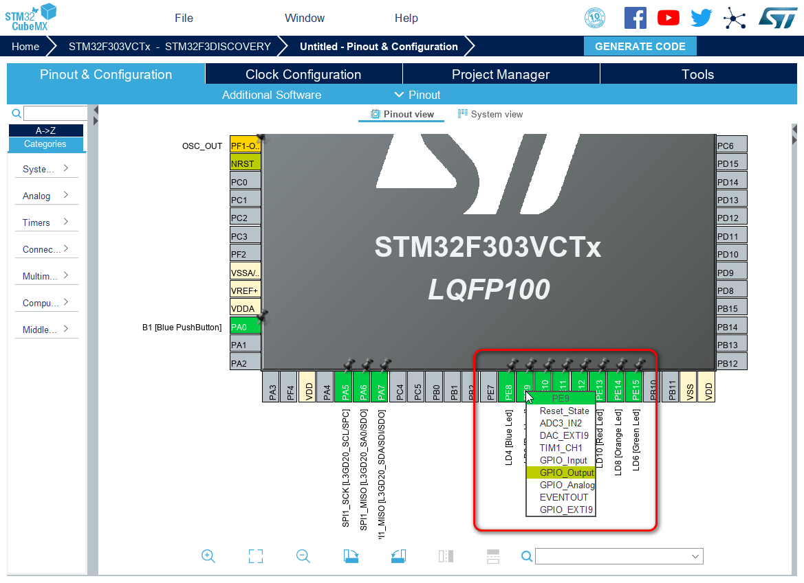
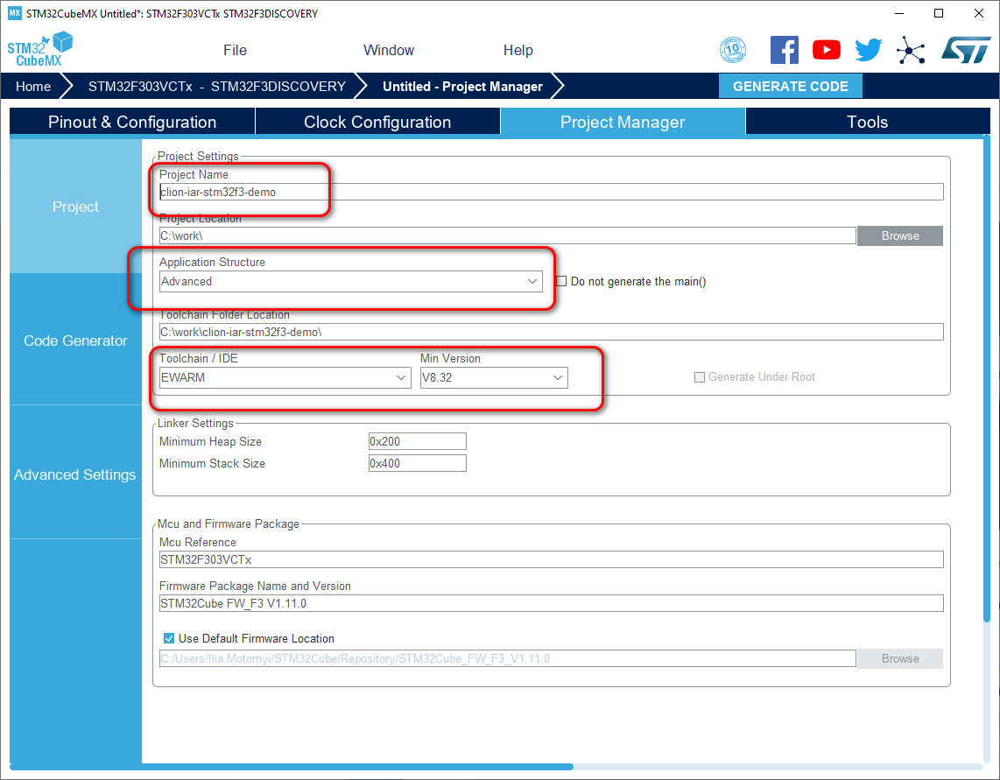
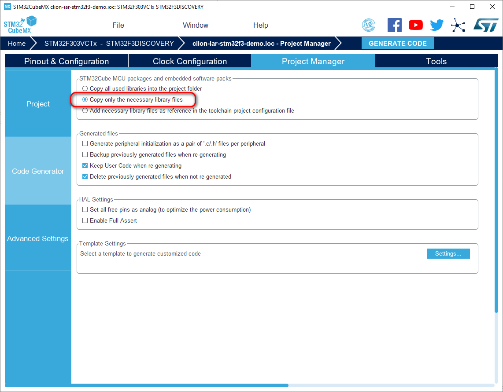
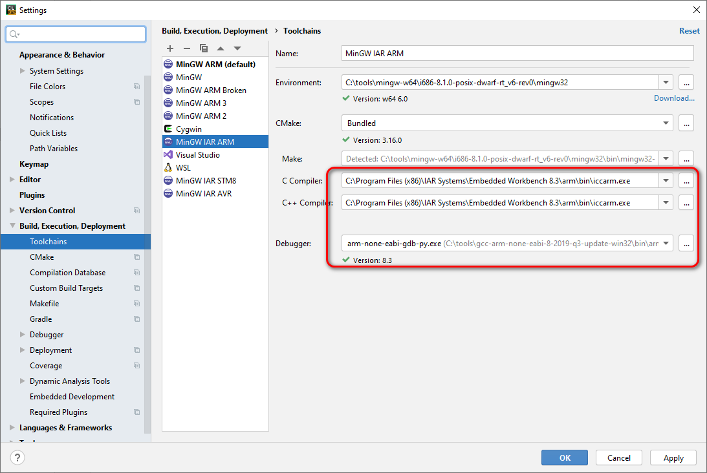
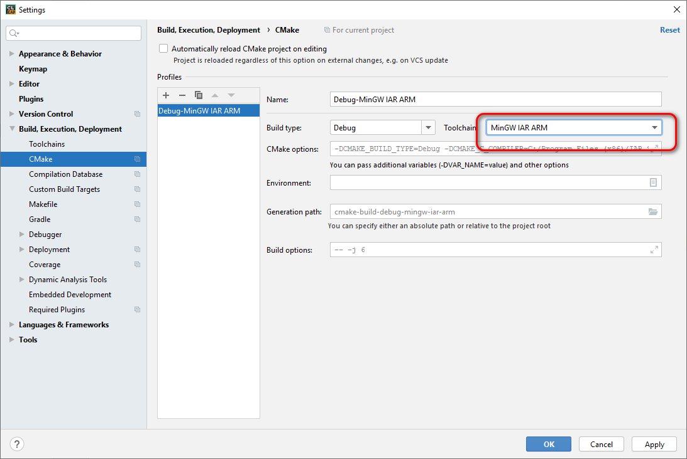
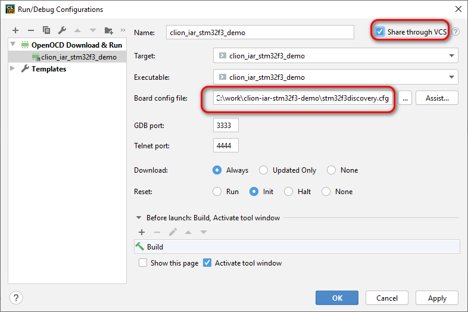

# Preface

We use STM32CubeMX because it’s very simple to use.  
If it’s not used(i.e. you do not use that or your chip is not STM32), just skip stage I and write your own startup code.

# Prerequisites

* Windows 7+

* Stm32CubeMX(optional)

* IAR Embedded WorkBench for ARM with a license

* MinGW installed

* ST-Link Jlink or any other required probe drivers

* OpenOCD 

* Ninja (build system) in system path

# Create a project

Start Stm32CubeMX, open board or mcu selector, select desired chip or board, and create the project. Important changes:
	





Then generate the project

# Clion Build settings




**NB**
There is an issue with `make` build system. Please put `-G Ninja` to *CMake options* line to workaround that

# CLion project adjustments

1. Add empty CMakeLists.txt to the project

2. Open the project in CLion (ignore CMake errors reported)

3. Initialize VCS(optionally)

    1. Add .gitignore:
*cmake-build-*
.mxproject
EWARM/*.ew?
.idea/workspace.xml
.idea/shelf*

    2. Create git repo then add and commit important stuff there

4. Write CMakeLists.txt
[CMakeLists.txt](MakeLists.txt)

5. Add code to the very end of main() function
 ```c /* USER CODE BEGIN WHILE */
  while (1)
  {
    /* USER CODE END WHILE */
    printf("Hello, World!\n");
    HAL_GPIO_TogglePin(LD3_GPIO_Port,LD3_Pin);
    HAL_Delay(400);
    /* USER CODE BEGIN 3 */
  }
  /* USER CODE END 3 */*
```
6. Reset CMake caches

# Debug

1. Open *Run Configurations*

    1. Drop existing one(s)

    2. Create *OpenOCD Download & Run*

    3. Click "Assist", find your board, or closest to your config

    4. Click "Copy to Project & Use"


    5. Open OpenOCD config file and add to the very end
*Init
arm semihosting enable*

2. Set breakpoint to the very beginning of main()

3. Click debug button

4. Wait a bit

5. Debugger works

6. Semihosting data is visible at "Run tab"

7. Enjoy!


